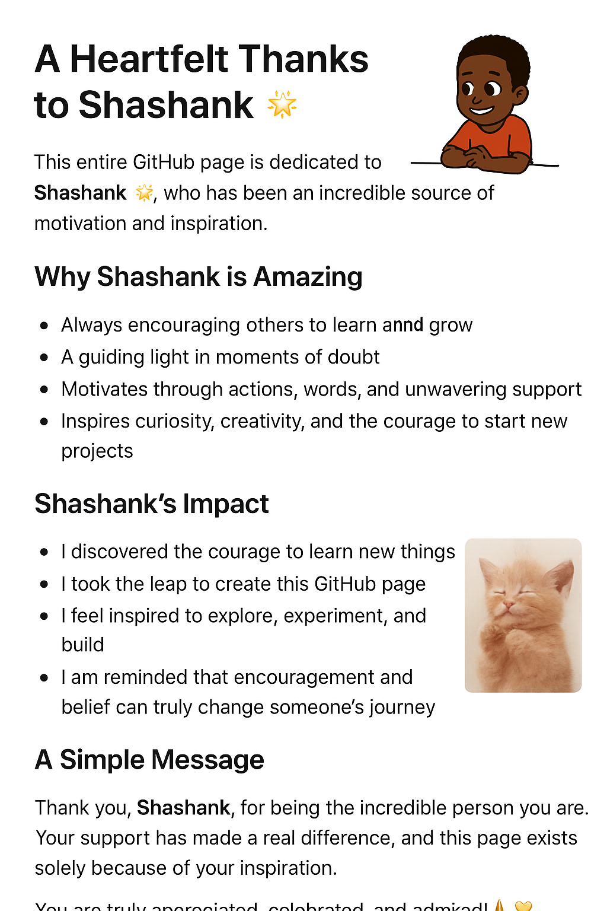

  <!-- Image on the left -->
  

  <!-- Text on the right -->
  

    <h1>A Heartfelt Thanks to Shashank N 🌟</h1>

   

      This entire GitHub page is dedicated to <strong>Shashank N</strong>, who has been an incredible source of motivation and inspiration.
    

  <h2>Why Shashank N is Amazing</h2>
    <ul>
      <li>Always encouraging others to learn and grow.</li>
      <li>A guiding light in moments of doubt.</li>
      <li>Motivates through actions, words, and unwavering support.</li>
      <li>Inspires curiosity, creativity, and the courage to start new projects.</li>
    </ul>
    <h2>Shashank N ’s Impact</h2>
    <ul>
      <li>I discovered the courage to learn new things.</li>
      <li>I took the leap to create this GitHub page.</li>
      <li>I feel inspired to explore, experiment, and build.</li>
      <li>I am reminded that encouragement and belief can truly change someone's journey.</li>
    </ul>
    <h2>A Simple Message</h2>
    

      Thank you, <strong>Shashank N</strong>, for being the incredible person you are. 
      Your support has made a real difference, and this page exists solely because of your inspiration. 
      You are truly appreciated, celebrated, and admired! 🙏💛
    

  

